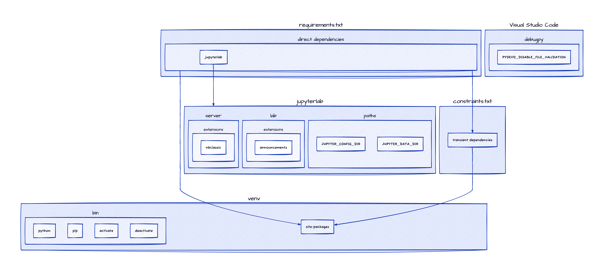

# End-to-end machine learning project

## Getting started

To install dependencies, configure settings, and run the associated Jupyter Lab server, please run:

```shell
./develop.sh
```

There's a video I made that describes the `develop.sh` script in detail, it can be seen here: https://youtu.be/BONnqNWpiuw

Here's the associated diagram used in the video to illustrate the relationship between items affected by `develop.sh`:


